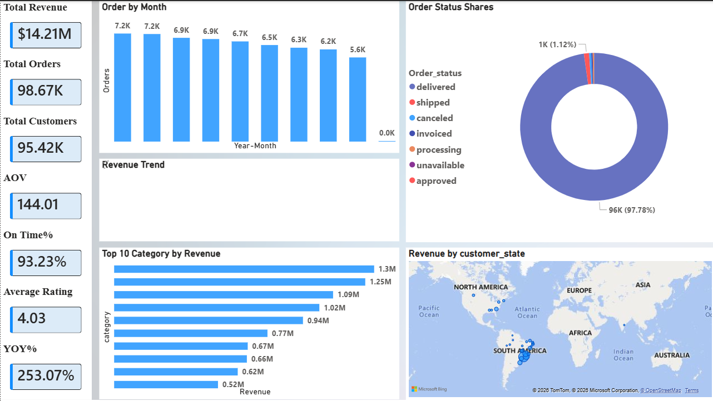
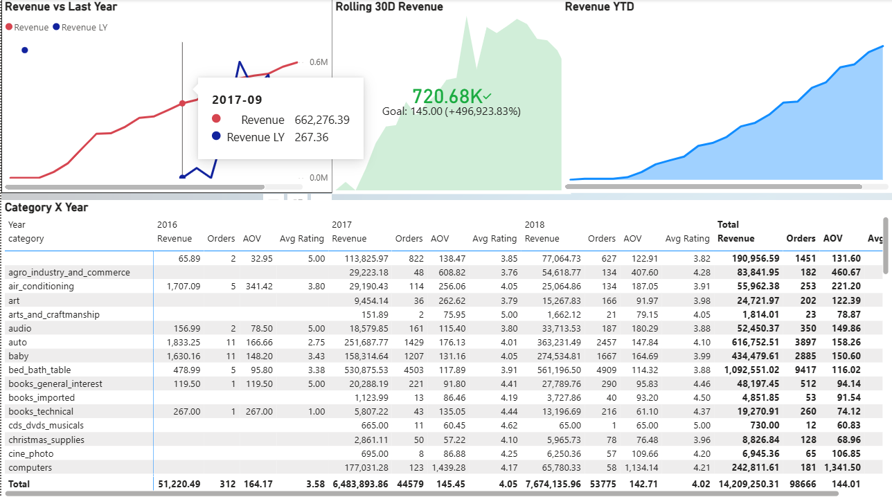
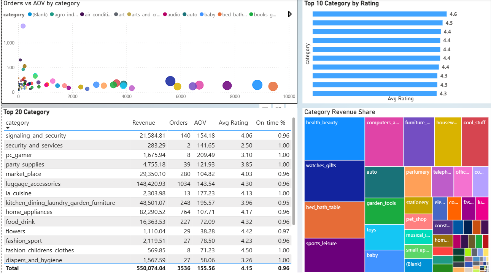
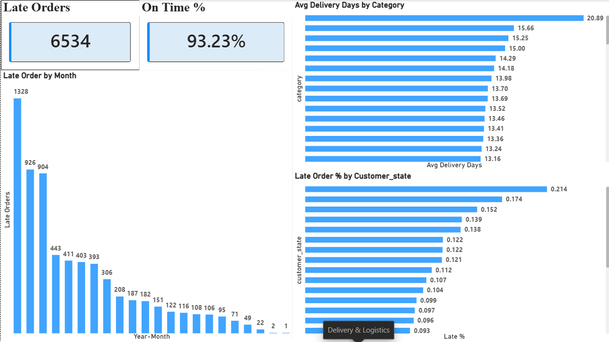
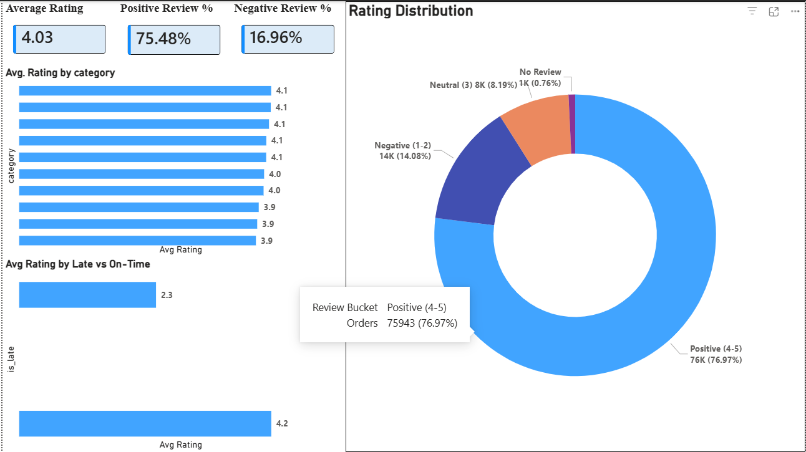
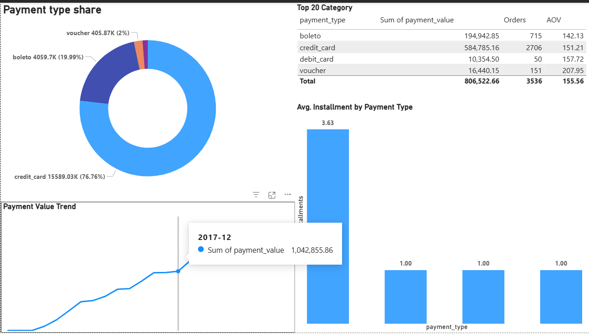
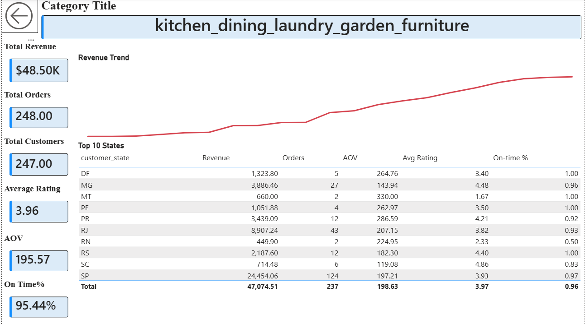

# End-to-End E-Commerce Analytics Pipeline (Olist Dataset)

A professional data engineering and business intelligence project demonstrating relational schema design, query optimization, and dynamic executive reporting.
**Data Source:** [Kaggle - Brazilian E-Commerce Public Dataset by Olist](https://www.kaggle.com/datasets/olistbr/brazilian-ecommerce)

---

## 🛠️ Project Workflow (15 Steps Deployed)
1. **Data Ingestion:** Downloaded Olist dataset (ZIP) from Kaggle and extracted all relational CSV files.
2. **Database Provisioning:** Created a local PostgreSQL database (`olist_db`).
3. **Schema Generation:** Formed raw tables for all CSVs (orders, items, customers, products, sellers, payments, reviews, and category translations).
4. **Data Loading:** Populated raw database tables using server-side bulk `COPY` commands.
5. **Data Validation:** Verified table integrity via row counts, null checks, sample selections, and uniqueness validations.
6. **Performance Engineering:** Generated B-Tree indexes on core join/filter keys (`order_id`, `customer_id`, `product_id`, `seller_id`, and purchase timestamps).
7. **Semantic Layer Design:** Built clean, optimized SQL views to isolate downstream reporting from transactional data complexity.
8. **View Testing:** Ran SQL `SELECT` queries to confirm zero row duplication and verify total calculations.
9. **Power BI Integration:** Connected PostgreSQL backend to Power BI Desktop via **DirectQuery** to simulate a live business framework.
10. **Data Selection:** Restricted model imports exclusively to the performance-optimized database views (anchored by `bi_fact_sales`).
11. **Time Modeling:** Created an independent `DimDate` calendar table loaded in Import Mode.
12. **Relationship Modeling:** Developed stable one-to-many relationships, verifying transactional tables remained locked to DirectQuery.
13. **Semantic Formula Deck:** Coded optimized DAX measures for core KPIs (Revenue, Orders, Customers, AOV, YoY Growth, and On-time Delivery %).
14. **Dashboard Layout Design:** Developed an interactive, 9-page executive-level reporting interface.
15. **Performance Tuning:** Optimized dashboard loading speeds by managing visual layout clusters and using the Performance Analyzer.

---

## 🎯 Key Skills Learned & Demonstrated
* **Database Setup:** Architected relational database tables and structured relationships in PostgreSQL.
* **Query Performance Tuning:** Eliminated DirectQuery lag by positioning targeted database indexes over operational join paths.
* **SQL Transformations:** Developed aggregate views and used window-ranking functions (`DISTINCT ON`) to clean transactional logs at the source.
* **Hybrid Modeling Engine:** Mastered live connections via DirectQuery while scaling time-intelligence using Import Mode tables.
* **Advanced Metrics Coding:** Formulated key performance indicators (YoY%, Rolling 30D Revenue, On-time Logistics %) using DAX formulas.

---

## 📈 Dashboard Walkthrough & Insights

### 1. Executive Strategy Overview

* **Insight:** The system monitors $14.21M in cumulative sales across 98.67K total orders, maintaining an Average Order Value (AOV) of $144.01.
* **Action:** Transaction velocities are high; operational resources must prioritize scaling fulfillment processing speeds.

---

### 2. Time-Series Sales Trends

* **Insight:** Highlights a massive YoY revenue expansion of 253.07%, climbing from a $51.22K baseline in 2016 to $7.67M in 2018.
* **Action:** Both short-term (Rolling 30D Revenue) and cumulative (Revenue YTD) indicators show a stable upward path.

---

### 3. Product & Category Matrix

* **Insight:** Validates the Pareto Principle (80/20 Rule); transaction density is heavily concentrated within health_beauty, watches_gifts, and bed_bath_table.
* **Action:** Reduce inventory overhead for slow-moving categories and feature high-velocity items in promotions.

---

### 4. Customer Geographical Dimensions

* **Insight:** Pinpoints extreme demand density within urban hubs; a single primary state region anchors the business with a $5.4M market share.
* **Action:** Setting up regional distribution centers in high-volume locations will drastically lower shipping costs and delivery times.

---

### 5. Delivery & Logistics Performance

* **Insight:** While the platform maintains a healthy 93.23% overall On-Time Delivery rate, a total of 6,534 shipments missed their target windows.
* **Action:** Logistics delay percentages spike up to 21.4% in outliers; operations must audit local courier contracts in those slow zones.

---

### 6. Customer Sentiment Cockpit

* **Insight:** On-time shipments retain a strong 4.2-star customer rating average, but delivery delays drop satisfaction scores to a low 2.3-star average.
* **Action:** Supply chain speed is the greatest driver of satisfaction; streamlining delivery is the fastest way to eliminate negative reviews.

---

### 7. Financial & Payments Breakdown

* **Insight:** Credit cards act as the primary financial driver, capturing a dominant 76.76% share ($15.59M) with an average installment rate of 3.63 months.
* **Action:** Because consumers favor installment split payments over upfront costs, introducing flexible financing options can increase AOV.

---

### 8. Merchant & Seller Benchmarking

* **Insight:** Marketplace revenue is highly centralized around top accounts; the top three sellers generate individual revenues of $244.63K, $237.87K, and $213.3K.
* **Action:** Secure long-term retention contracts with these key vendors to ensure product availability and mitigate churn risks.

---

### 9. Dynamic Diagnostic Drillthrough

* **Insight:** Allows users to isolate single categories (e.g., kitchen_dining_laundry_garden_furniture), immediately surfacing its specific $48.50K revenue and 95.44% on-time rate.
* **Action:** Category managers can leverage this interactive interface to track inventory variables and benchmark newly launched products.
